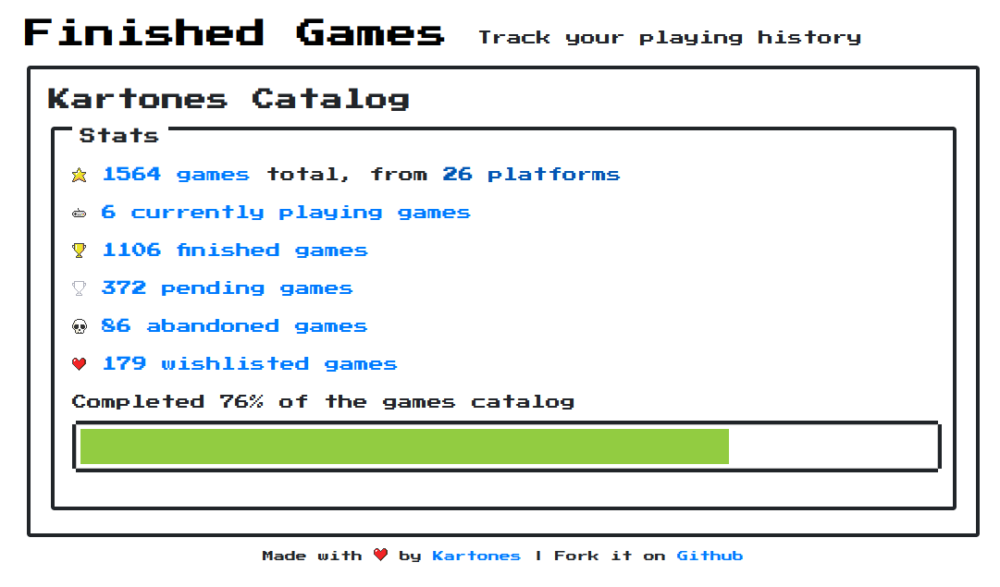

# Finished Games Viewer

## Introduction

Javascript-based viewer for my [Finished Games](https://github.com/Kartones/finished-games) project.

## Instructions

It uses JSON data exported via the `manage.py export_user_catalog <a-username>` command inside **Finished Games**. After exporting the data, place it inside the `data` subfolder.

### Development

For development you need to have installed [`NodeJS`](https://nodejs.org/en/download/) and [pnpm](https://pnpm.io/).

Upon first checkout of the repository, you must run `pnpm install`.

When you want to run the dev server (does not use NodeJS), `pnpm start`.

If you want to run the (few) tests, `pnpm test`;

### Production

For production you don't need anything other than a web server (e.g. [`nginx`](https://nginx.org/)). Simply copy the following folders and files:

- `css/`
- `data/` (with your data)
- `js/`
- `templates/`
- `favicon.ico`
- `index.html`

## Roadmap

- if at home, don't transition/navigate (using https://unpoly.com/up.history ?)
- try activating navigation upon rendering (https://unpoly.com/up.render)
- more tests
- constants/enums
- revisit `components.js` to extract to functions more logic, and think about changing some stuff to be Decorators or Builders
- views.js and components.js should not access global state (appData) directly, should be passed as arg
- build true components, like a table. For historical reasons the table was built in chunks (via "template tags" at the original FG project), but now can be a proper reusable class